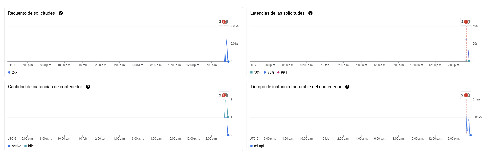
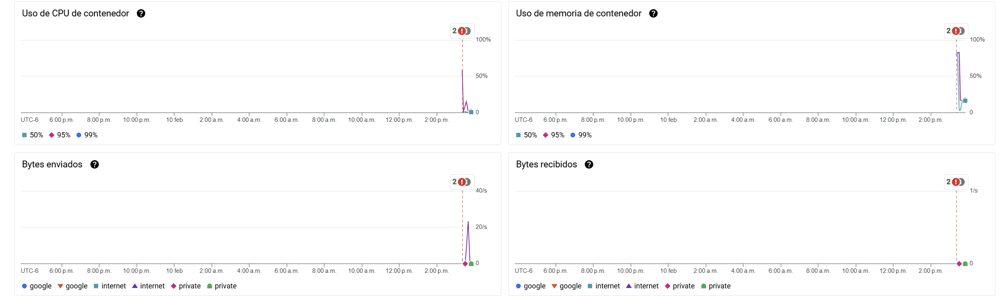
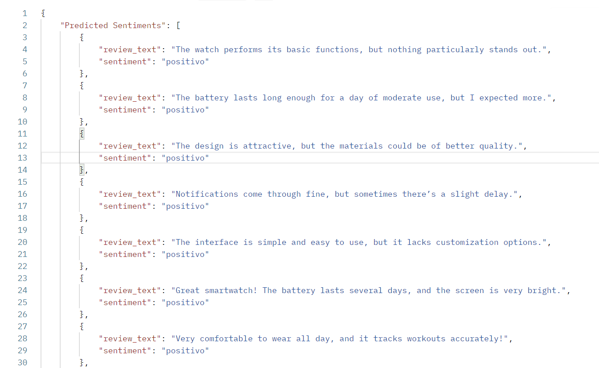
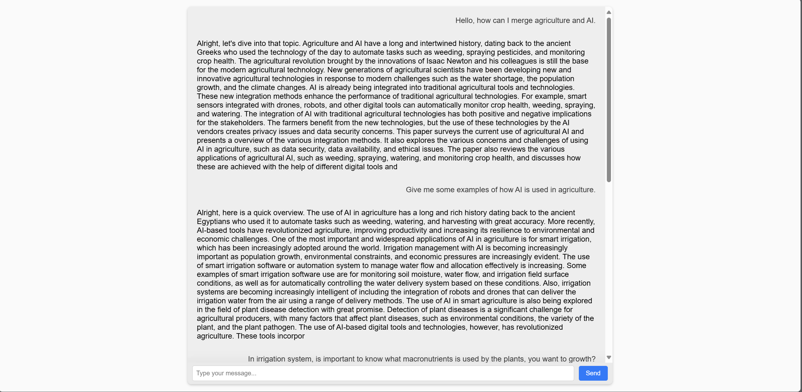
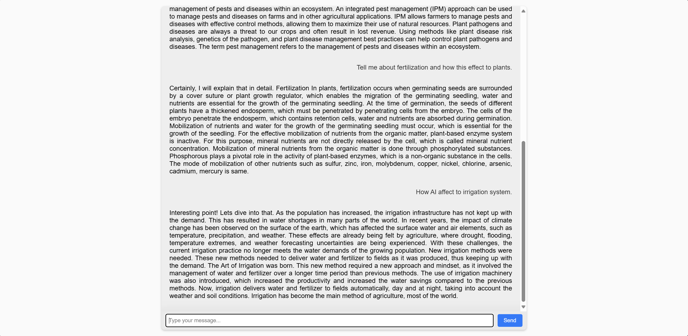

# AI/MLOps Engineer

#### Technical Skills: Python, PyTorch, PostgreSQL, GCP

## Education
- B.E, Agricultrual Desgin and Automation | Universisad Autonoma De Ciudad Juarez (_2018-2023_)

# Project Experience

#### Sentiment Analysis

**Web Scraping**
- **Description**: extract reviews and metadata of products from websites automatically.
   - **Tools**:
     - `Scrapy`  for HTML parsing and Data extraction at a larger scale.

**Data Cleaning and Processing**
   - **Description**: Transformation of raw data into structured and clean data.
   - **Tools**: `Pandas`, `re` (regular expressions).

**ETL (Extract, Transform and Load)**
   - **Description**: Implementation of an ETL pipeline to load the clean data into a database.
   - **Tools**:
     - `Pandas` y `SQLAlchemy` for ETL operations.

**Storage in PostgreSQL**
   - **Description**: Structured and efficient data storage.
   - **Tools:** PostgreSQL with `SQLAlchemy` ORM.

**Sentiment Analysis**
   - **Description**: Identification of the sentiment associated with each review.
   - **Tools**: `PyTorch`, `NLTK`, `Scikit-Learn`.

**Docker**
- After the model is completed and has created the API, it is used to create the docker image. Giving way to using multistage builds to reduce image weight, I avoid high runtime times on CI/CD with GITHUB Actions.

**Google Clodu Run**
 - Giving use to the created docker image, making deploy of this in google cloud. First of all this docker image is move on to Artifact Registry and then use GCR.

**Monitoring Dashboard:**  
    
    
  _Description:_ Real-time view of requests and responses processed by the API through Google Cloud Run.
 - **API Response Example:**  
    
  _Description:_ Example of the returned JSON showing the sentiment ranking and corresponding score.

- **Conclusion:**  
  In summary this project represents a significant advancement integration of Data Science and MLOps, providing end-to-end Sentiment Analysis Reviews solution. The implemented architecture guarantees efficient and scalable workflow, encompassing data acquisition and processing to automated cloud deployment.  The use of automated pipelines for model building and inference, combined with a robust CI/CD strategy, underscores our commitment to quality, agility, and innovation. This approach not only solves today's problems but also gets us ready for future improvements and adaptations in high-demand environments, positioning the project as a benchmark in the field of industrial artificial intelligence.

## Chatbot based on Transformers for Agriculture

**Selection of the base model in Hugging Face**
- I selected TinyLlama/TinyLlama-1.1B-intermediate-step-1431k-3T model. The TinyLlama project aims to pretrain a 1.1B Llama model on 3 trillion tokens. This model
  is perefect when you don't have enough resources to train llama model then for that reason I used this model.

**Trained in PyTorch, with transformers, trl, peft and accelerate libraries**

**Apply Optimize Techniques**
- Such as Bytes and bits to reduce the size model and gain performance to train model. LoRA this makes training much faster, memory-efficient, and produces smaller model weights (a few hundred MBs), which are easier to store and share. PEFT approaches only fine-tune a small number of model parameters while freezing most parameters of the pretrained LLMs, thereby greatly decreasing the computational and storage costs. SFTTrainer, is a tool for creating and training supervised fine-tuning (SFT) models, a crucial step in Reinforcement Learning with Human Feedback (RLHF). It simplifies the process of adapting pre-trained language models (LLMs) to specific tasks using labeled data. I use DPO in this case, Direct Preference Optimization (DPO) is a method for aligning Large Language Models (LLMs) with human preferences, offering a streamlined alternative to Reinforcement Learning from Human Feedback (RLHF) by directly optimizing the model's parameters based on preference data, without requiring a separate reward model.

**Here is a quick and short Response of the model in local**
- <|user|> Tell me how can I integrate AI in agriculture, and provide me some examples, please!.</s>

  <|assistant|> Alright, here is a quick overview. AI and agriculture go hand in hand because it is widely recognized that the use of digital technologies in agriculture has a positiveimpact on product quality, productivity, and labor stability. The use of AI in agriculture has a number of benefits for farmers, some of which include improved yield, quality, and distribution; improved water efficiency; improved pest and disease management; and improved professional service.

**Deploy API for this model and front-end service**
- I deployed an API with flask and also the front-end. This is how it looks my ChatBot in Docker.

- Antoher Responses of the Model

**Docker Image**
- Status: Finished

**Deploy on GKE**
- Status: in development

**Conclusion:**
I developed this chatbot in the topic of agriculture, because in the city I live, most growthers, agricultural engineers, don't do the best practices for efficent growth development of his crops. And due to the bad use of water, macronutrientes, phenology of plants and all related to his development then I fine-tuning with a high-level information to do the most effciente-practices to agricultutre, the idea is deploy this chatbot in real-time interaction for have healthy crops and great use of resources. Furthermore continously adding more information to the chatbot and implment RAG, for stay up to date with new practices and investigations.
